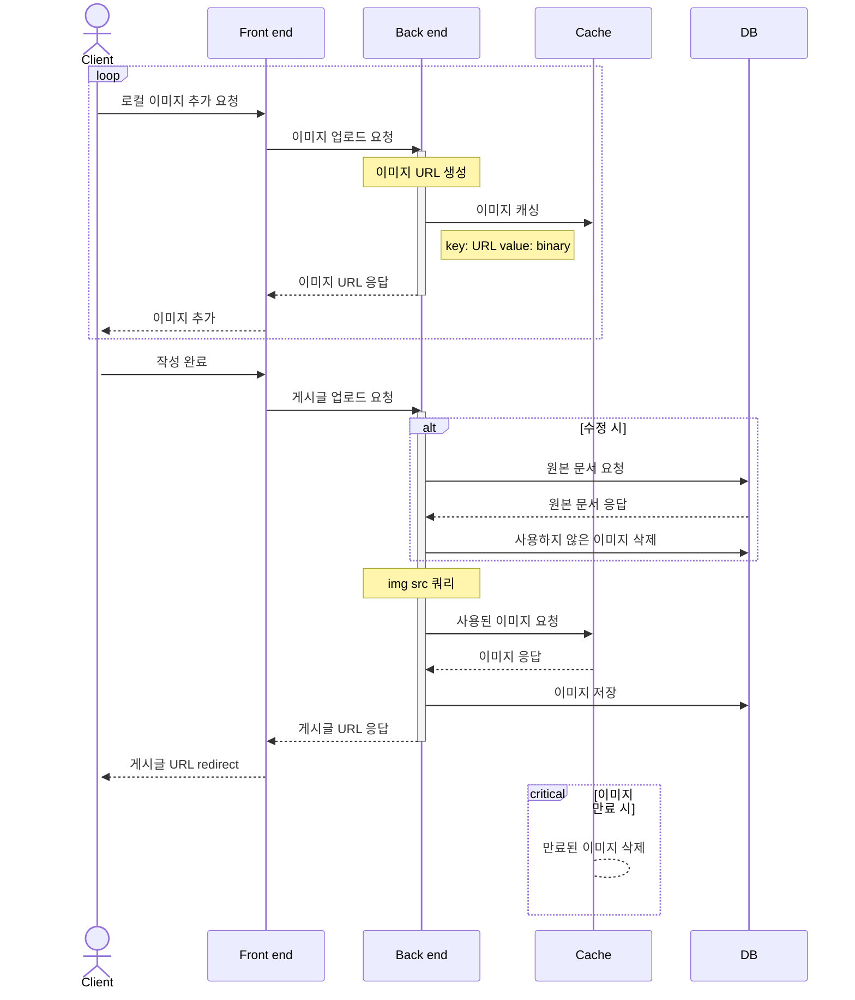

앞서 요구사항에서 게시글 작성/수정시 HTML/CSS를 지원해야 한다고 했는데, 구현하기 전 고려해야 하는 요소가 몇 가지 있습니다.

## WYSIWYG

백엔드에서 HTML과 CSS를 지원한다는 것은 유저가 작성한 HTML을 그대로 입력받아 서버에서 처리해야 함을 의미합니다.

프론트 엔드에서는 어떨까요?

대부분의 유저는 HTML/CSS를 모르고, 알아도 직접 작성하기에는 생산성이 떨어집니다.

따라서 HTML/CSS를 지원하는 작성 기능의 경우 WYSIWYG 에디터로 문서를 작성할 수 있게 구현합니다.

WYSIWYG는 "What You See Is What You Get"의 약자로, 편집하는 대로 문자, 색상, 글꼴 등 보이는 것이 결과와 동일하게 나오는 방식입니다.

해당 프로젝트는 백엔드 프로젝트라 구현까지 하진 않겠지만 프론트에서 어떻게 처리하는지 간단한 이해만 하셔도 좋습니다.

## 이미지 추가/삭제

WYSIWYG에서 로컬 이미지를 추가 할 시 처리 방법은 크게 두가지가 있습니다.

1. 이미지를 base64로 변환

    장점: 구현이 간단함. 백엔드에서 따로 처리 필요 없음. 프론트 엔드에서 btoa() 호출로 간단하게 변환 가능

    단점: [이미지 용량 증가](https://developer.mozilla.org/en-US/docs/Glossary/Base64), 이미지에 대한 추가적인 처리 어려움

2. 이미지를 서버로 업로드 해 URL 응답

    장점: 용량 감소, 필요 시 이미지 추가적인 처리 가능

    단점: 추가/삭제 시 백엔드에 추가 로직 필요. 프론트 엔드에서 업로드 콜백 함수 구현 필요

2번 방식의 경우 유저가 이미지를 문서에서 삭제하거나, 문서를 작성하지 않고 중단하거나, 문서를 수정할 경우 사용하지 않는 이미지가 남는 문제가 생깁니다.

이를 방지하기 위해 방법 중 하나로 이미지를 캐싱한 뒤, 업로드된 문서와 비교해 사용하지 않은 이미지를 삭제하는 방법이 있습니다.

시퀸스 다이어그램:



코드:
```csharp
public IActionResult Write(string title, string content, string[] tags)
{
    Post post = new(title, content, tags);
    string[] imgSrcs = GetImgSrcs(content);
    Dictionary<string, byte[]> cachedImgs = GetCachedImages();
    _dbContext.Images.AddRange(cachedImgs.Select(k => new Image(k.Key, k.Value)));
    _dbContext.SaveChanges();
    return CreatedAtAction(...);
}

public IActionResult Edit(int postId, string title, string content, string[] tags)
{
    Post post = _dbContext.Posts.Find(postId);
    string[] oldImgSrcs = GetImgSrcs(post.Content);
    string[] newImgSrcs = GetImgSrcs(content);

    try 
    {
        using var transaction = _dbContext.Database.BeginTransaction();
        IEnumerable<string> deletedImgSrcs = oldImgSrcs.Except(newImgSrcs);
        _dbContext.Images.Where(i => deletedImgSrcs.Contains(i.Uri)).ExecuteDelete();

        post.Title = title;
        post.Content = content;
        post.Tags = tags;
        _dbContext.SaveChanges();
        transaction.Commit();
    }
    catch (Exception e)
    {
        transaction.Rollback();
    }
    return CreatedAtAction(...);

}

private Dictionary<string, byte[]> GetCachedImages(string[] srcs)
{
    return ... // 캐싱된 이미지 요청
}

private string[] GetImgSrcs(string content)
{
    return ...; // img src 쿼리
}
```

## XSS 방지

[XSS](https://developer.mozilla.org/ko/docs/Glossary/Cross-site_scripting)는 Cross-site Scripting의 약자로, 공격자가 사이트에 스크립트 코드를 삽입하는 취약점 공격입니다.

피해자에 의해 실행되 공격자가 제어를 우회해 사용자로 위장할 수 있습니다.

ASP.NET Core는 스크립트를 자동으로 읽지 않으므로 해당 프로젝트에선 원본을 저장하고 응답 시 [HtmlSanitizer](https://github.com/mganss/HtmlSanitizer)로 필터링해 XSS 공격을 방지합니다.

```csharp
public PostDto GetPost(int id) 
{
    Post post = _dbContext.Posts.Find(id);
    string sanitizedContent = _sanitizer.Sanitize(post.Content);
    PostDto dto = CreatePostDto(post, sanitizedContent);
    return dto;
}
```
